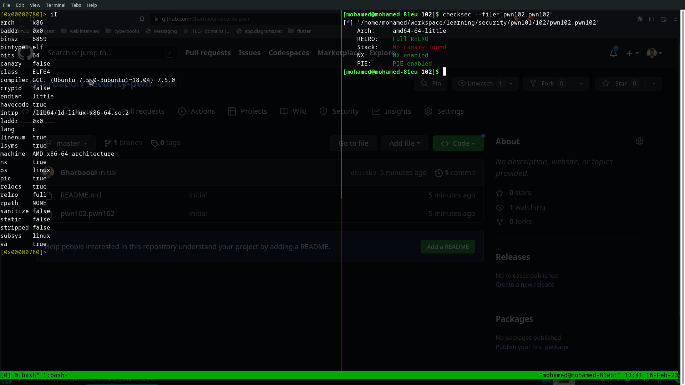
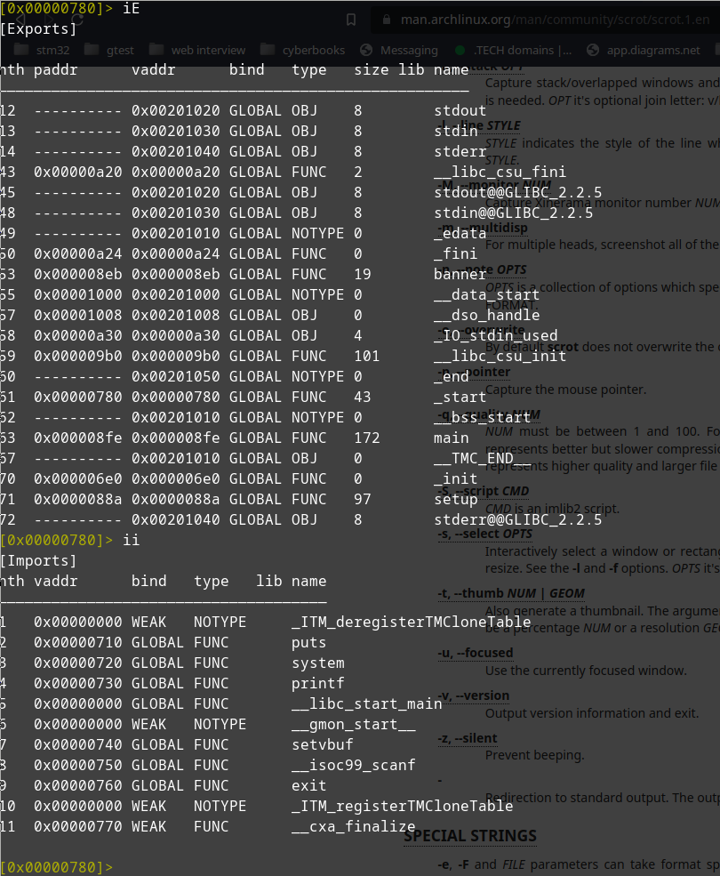

### pwn102 of tryhackme binary explotation

##### recon about the file

##### imports/exports

*
as you can see imports binary is using system so maybe there's route
that will use it to give us a shell
there's scanf probably overflow and from first recon we can see that
cannary is false so bufferflow is easy
*
