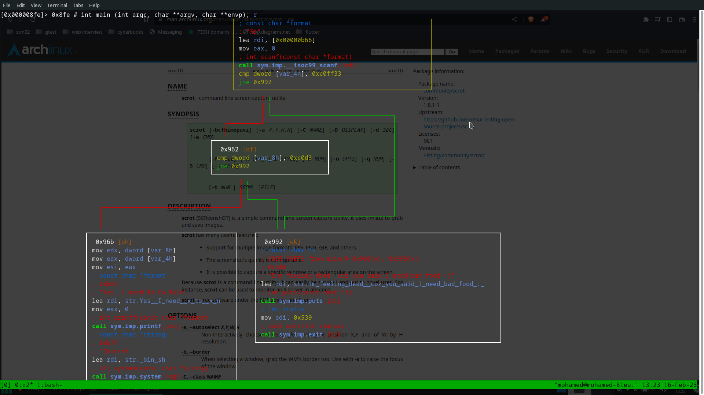
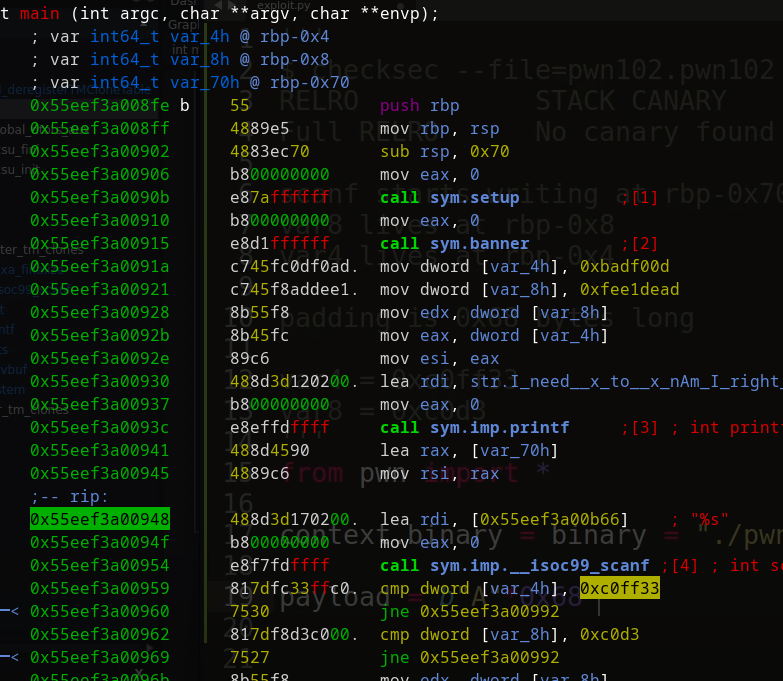

### pwn102 of tryhackme binary explotation

##### recon about the file

##### imports/exports

*as you can see imports binary is using system so maybe there's route
that will use it to give us a shell
there's scanf probably overflow and from first recon we can see that
cannary is false so bufferflow is easy*

as you can see there's compare in main with value of 0xc0ff33 with what is at rbp-0x4
should be equale so we do not end up on the right side which as you can see
just prints str and exit
if we pass the first jne we will end in other compare that we should avoid also to get shell

as you can see that scanf will be called with address rbp-0x70
and what we need to override is at rbp-0x8 and  rbp-0x4
so we need padding of 0x70-0x8 = 0x68
